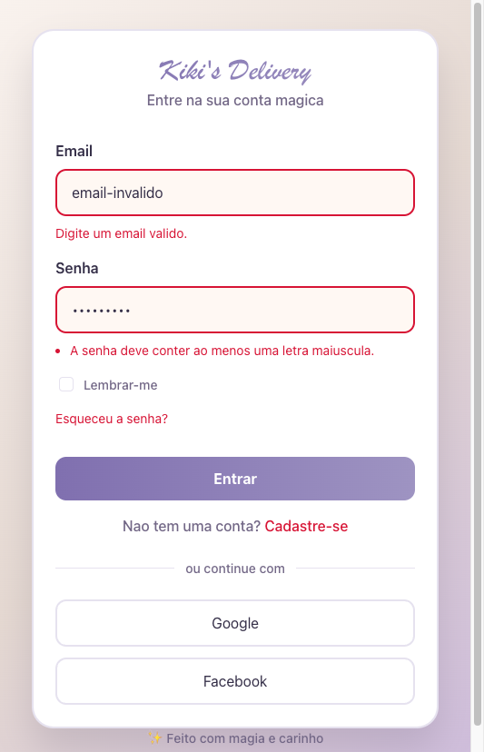
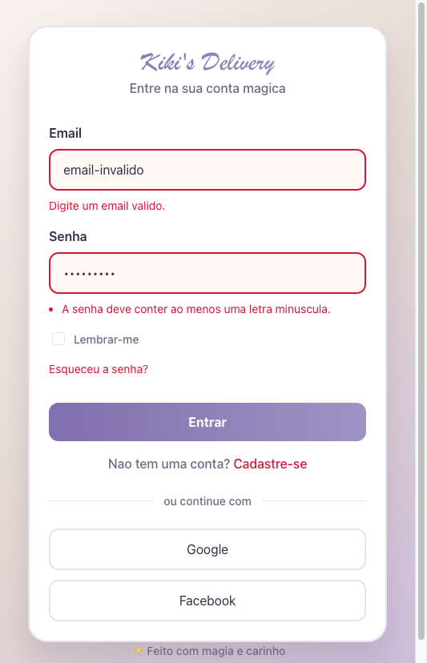
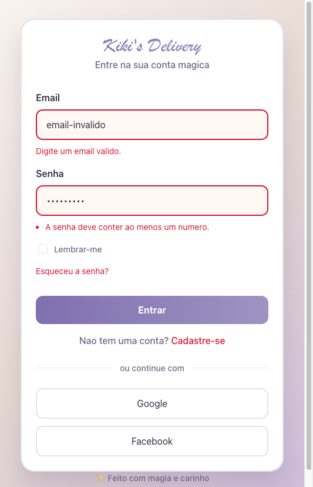
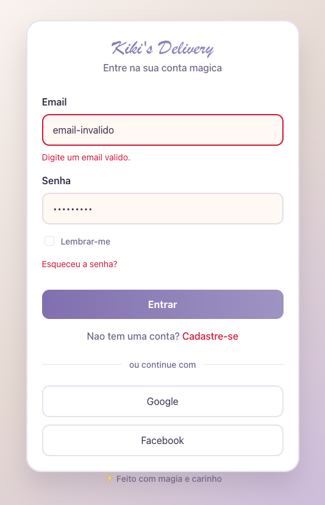

# Cursor Frontend Automation

Tela de login desenvolvida em React + TypeScript com foco em UX de validacao em tempo real.

O projeto simula um fluxo moderno de autenticacao no front-end, com feedback visual claro, validacoes de email e senha, e toast de sucesso quando os dados estao corretos.

## Objetivo

Este projeto foi construido para praticar e demonstrar:

- composicao de componentes reutilizaveis
- validacao de formularios com hooks customizados
- testes de interface com Testing Library + Vitest
- boas praticas de UX para exibicao de erros

## Funcionalidades

- Campo de email com validacao de formato.
- Campo de senha com regras:
  - minimo de 8 caracteres
  - ao menos uma letra maiuscula
  - ao menos uma letra minuscula
  - ao menos um numero
- UX de senha ajustada:
  - durante digitacao, mensagens aparecem somente quando chega em 8 caracteres
  - ao clicar em Entrar com menos de 8 caracteres, erro de tamanho minimo e exibido
- Destaque visual no input quando ha erro.
- Toast de sucesso com Sonner quando email e senha estao validos ao clicar em Entrar.
- Suite de testes para os componentes de validacao.

## Stack

- React 18
- TypeScript
- Vite
- Vitest
- Testing Library
- Sonner (toast)

## Como executar

### 1. Requisitos

- Node.js 18+ (recomendado)
- npm

### 2. Instalar dependencias

```bash
npm install
```

### 3. Rodar em desenvolvimento

```bash
npm run dev
```

### 4. Rodar testes

```bash
npm test
```

### 5. Gerar build de producao

```bash
npm run build
```

### 6. Visualizar build

```bash
npm run preview
```

## Scripts disponiveis

- `npm run dev`: inicia o servidor de desenvolvimento
- `npm test`: executa os testes com Vitest
- `npm run build`: gera bundle de producao
- `npm run preview`: sobe a versao buildada localmente

## Estrutura principal

```text
src/
  components/
    EmailField.tsx
    PasswordField.tsx
  hooks/
    useEmailValidation.ts
    usePasswordValidation.ts
  test/
    setup.ts
  App.tsx
  App.css
```

## Screenshots

As imagens abaixo mostram diferentes estados da validacao:

- Erro de email invalido  
  

- Senha sem letra maiuscula  
  

- Senha sem letra minuscula  
  

- Senha sem numero  
  

- Senha valida sem erros  
  

## Observacoes

- Este projeto nao possui integracao com backend ou autenticacao real.
- O fluxo de login e totalmente demonstrativo no front-end.
- O toast de sucesso representa o estado de formulario valido.

## Licenca

Projeto para fins educacionais e de laboratorio.
